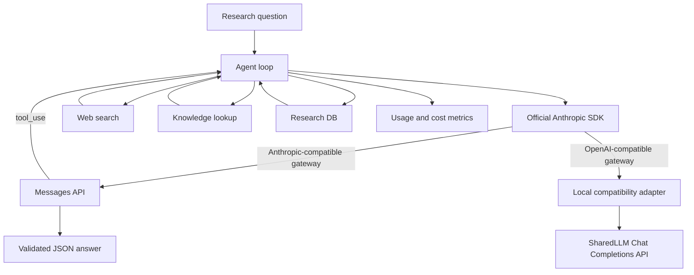

# Architecture

The TypeScript application always sends Anthropic Messages calls through the official Anthropic SDK. After `npm run probe`, an Anthropic-compatible gateway is used directly. For an OpenAI-compatible SharedLLM gateway, a local SDK fetch transport maps Anthropic Messages requests to Chat Completions and converts function tool calls and token usage back to Anthropic-shaped blocks before the SDK receives them. Tool results are converted to OpenAI `role: tool` messages on the following turn.

OpenAI-compatible mode does not assert native support for Anthropic prompt caching or extended thinking: `cache_control` and `thinking` are not transmitted, cache token values remain zero, and metrics mark both capabilities unavailable. The stable prompt and tool schemas remain fixed between requests as an application-level prompt-stability equivalent, not a cache-hit claim.
