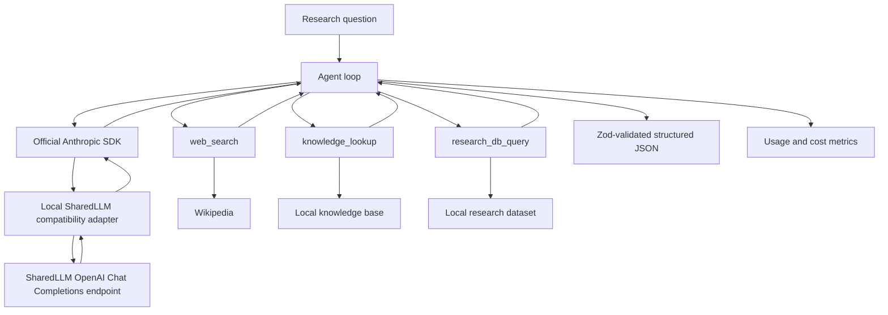

# Architecture

The official Anthropic SDK remains the application interface. The local adapter is used only for the documented OpenAI-compatible SharedLLM gateway: it translates request, tool, tool-result, and usage shapes. Structured validation and cost estimation are application-level features. Native Anthropic thinking and prompt-cache behavior are not claimed in OpenAI-compatible mode.
